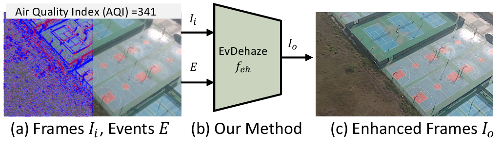
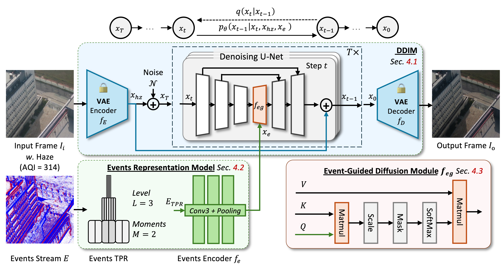
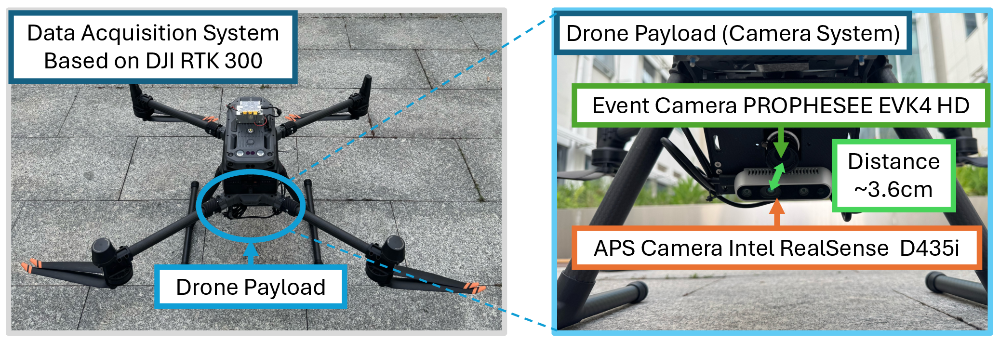
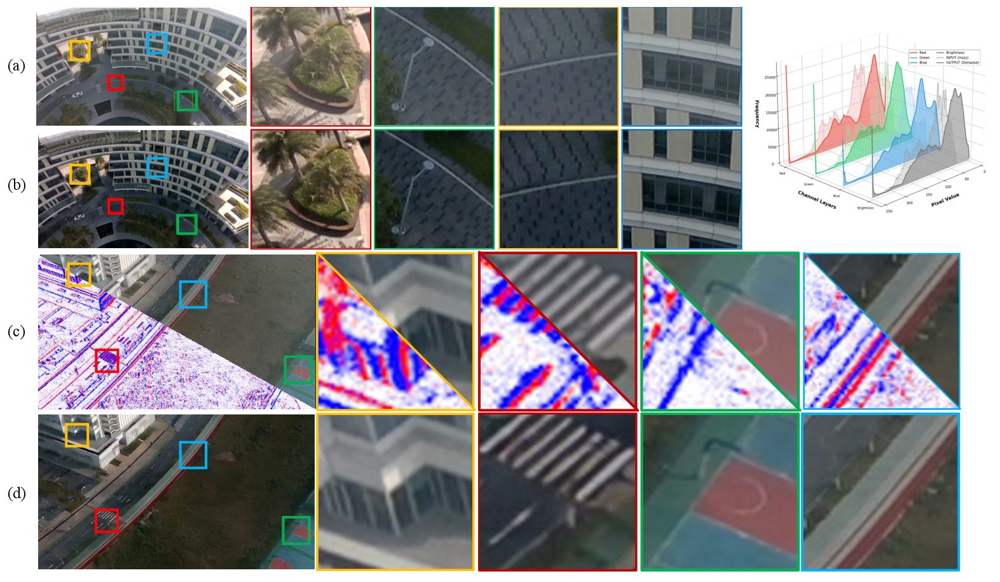
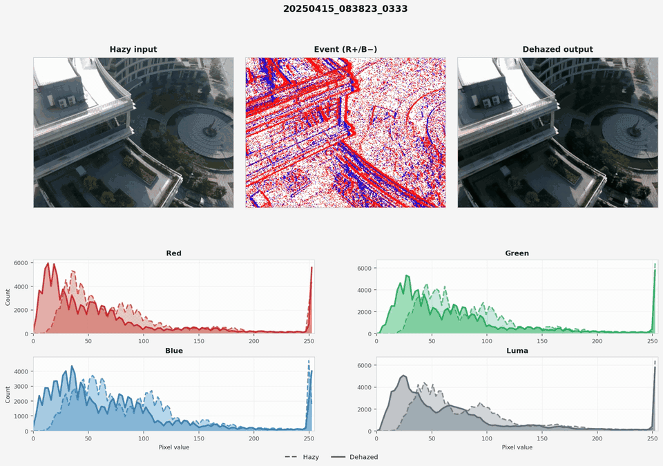
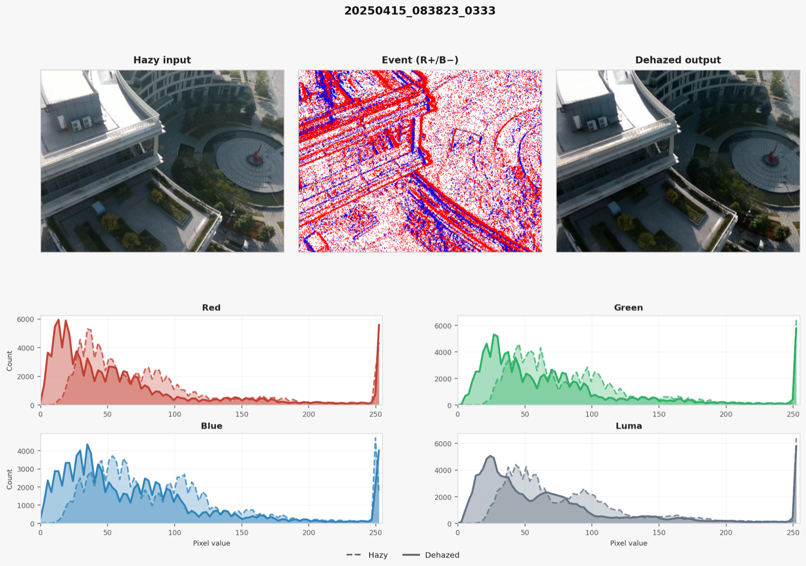
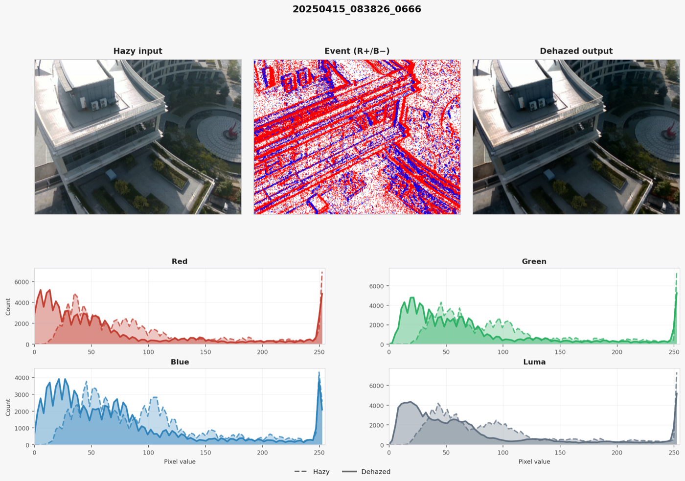

<h2 align="center">[CVPR 2026] From Events to Clarity:<br>The Event-Guided Diffusion Framework for Dehazing</h2>

<div align="center">

**[Ling Wang](https://daviswang0.github.io/)<sup>\*</sup>, [Yunfan Lu](https://yunfanlu.github.io/)<sup>\*</sup>, [Wenzong Ma](https://anthony-ecpkn.github.io/), [Huizai Yao](https://huizaivictoryao.github.io/), Pengteng Li, [Hui Xiong](https://ailab.hkust-gz.edu.cn/index.html)<sup>†</sup>**

The Hong Kong University of Science and Technology (Guangzhou)

<sup>†</sup>Corresponding author

[](https://evdehaze.github.io/)
[](https://cvpr.thecvf.com/virtual/2026/poster/37331)
[](https://cvpr.thecvf.com/virtual/2026/poster/37331)

</div>

<p align="center">
  
</p>

## Introduction

This repository contains the official implementation of **EvDehaze**, the first event-guided diffusion framework for image dehazing.

Existing image dehazing methods mainly rely on conventional RGB frames, which suffer from limited dynamic range under dense haze. Once scene structures and illumination details are suppressed by scattering, frame-only models can produce residual haze, over-smoothed textures, or unrealistic restoration artifacts.

EvDehaze introduces event cameras into dehazing. Events provide high dynamic range sensing and microsecond temporal precision, making them a natural source of structural and contrast cues under severe visibility degradation. We formulate event-guided dehazing as a conditional generation problem and inject event features into a latent diffusion process through cross-attention.

**TL;DR:** EvDehaze uses HDR event cues to guide diffusion-based dehazing, producing clearer structures and more natural contrast in synthetic and real hazy scenes.

## Key Highlights

- **First event-guided dehazing framework.** We introduce event cameras to image dehazing and formulate the task as event-conditioned diffusion generation.
- **HDR structural guidance.** A temporal pyramid event representation extracts sparse but reliable edge, corner, and contrast cues from event streams.
- **Event-guided diffusion module.** Event features are injected into the denoising U-Net via cross-attention across DDIM sampling steps.
- **Real-world RGB-event haze dataset.** We collect synchronized RGB and event data with a UAV-mounted sensing rig under heavy haze for real-world evaluation.
- **Strong diffusion baseline.** EvDehaze achieves the best overall performance among diffusion-based dehazing methods on SOTS and NH-HAZE.

## Method

<p align="center">
  
</p>

Given a hazy RGB frame and the corresponding event stream, EvDehaze predicts a dehazed output through three components:

- **Latent DDIM backbone with frozen VQ-VAE:** the hazy frame is encoded into a latent space, refined through DDIM denoising, and decoded back to the image domain.
- **Event representation model:** raw events are converted into a temporal pyramid representation and encoded by lightweight convolutional layers.
- **Event-guided diffusion module:** event features guide intermediate U-Net features through cross-attention, helping the sampler recover edges, textures, and contrast that are weak or missing in RGB observations.

## Real-World RGB-Event Haze Dataset

<p align="center">
  
</p>

We build a UAV-based acquisition platform with a PROPHESSEE EVK4 HD event camera and an Intel RealSense D435i RGB camera. The dataset is captured in outdoor hazy scenes with synchronized RGB-event recording, supporting qualitative evaluation under real visibility degradation.

The supplementary material reports **6,674 event segments** and **61,173 aligned hazy RGB images**. Dataset release details will be added to the project page.

### Synthetic RGB-Event Data

<p align="center">
  
</p>

We also augment [RESIDE/SOTS](https://sites.google.com/view/reside-dehaze-datasets/reside-v0) with simulated events under radial, rotational, and translational motions, enabling supervised training and evaluation with paired hazy/clear RGB images and corresponding event streams.

## Results

<p align="center">
  
</p>

### Real-World Visualization

<p align="center">
  
</p>

[Download the MP4 version](assets/videos/realworld_panel.mp4).

The following panels show representative real-world UAV captures with hazy input, event visualization, dehazed output, and RGB/luma histogram comparisons.

<p align="center">
  
  
</p>

### Quantitative Comparison

| Method | Diffusion | SOTS PSNR | SOTS SSIM | SOTS LPIPS | NH-HAZE PSNR | NH-HAZE SSIM | NH-HAZE LPIPS | Params |
| :--- | :---: | ---: | ---: | ---: | ---: | ---: | ---: | ---: |
| IR-SDE | Yes | 33.82 | 0.984 | 0.014 | 12.59 | 0.520 | 0.361 | 537.21M |
| ResShift | Yes | 29.06 | 0.950 | 0.017 | 16.26 | 0.625 | 0.327 | 114.65M |
| **EvDehaze** | **Yes** | **34.12** | **0.986** | **0.012** | **18.43** | **0.637** | **0.313** | 122.68M |

**Evaluation protocol.** Due to limited compute resources (some experiments were finalized after graduation, when access to the university HPC cluster was no longer available), our quantitative experiments follow the settings and reported baselines from [DiffLID](https://github.com/aaaasan111/difflid). To ensure a fair comparison between transformer-based and diffusion-based methods, we uniformly use a training-free bicubic resizing protocol and compute metrics at **128 x 128** resolution. For final qualitative visualizations, we consistently run and display results at the original resolution.

EvDehaze is designed as a generative, event-guided diffusion method. Its main target is perceptual realism under haze: clearer edges, stronger contrast, and fewer artifacts in real-world scenes.

## Core Folders and Files

### Inference and Evaluation

- `inference.py`: evaluation script for SOTS/NH-HAZE with PSNR, SSIM, and LPIPS.
- `visualize.py`: original-resolution visualization on configured validation data.
- `visualize_realworld.py`: visualization for real-world RGB-event captures.
- `configs/`: YAML configurations for SOTS, NH-HAZE, and full-resolution visualization.
- `checkpoints/`: expected location for released EvDehaze diffusion and resample checkpoints.
- `weights/`: expected location for the frozen VQ-f4 autoencoder checkpoint.

### Training and Data

- `main.py`: distributed training entry point.
- `trainer.py`: training logic for event-conditioned latent diffusion.
- `models/`: EvDehaze, diffusion, ResShift, Swin/UNet, and utility modules.
- `datapipe/`: paired image-event dataset loaders and degradation utilities.
- `scripts/train_sots.sh`: SOTS/RESIDE training launcher.
- `scripts/train_nhhaze.sh`: NH-HAZE training launcher.
- `scripts/preprocess_realworld_events.py`: RGB-event pairing and event voxel cache builder for real-world captures.

## Installation

```bash
git clone https://github.com/DavisWANG0/EvDehaze.git
cd EvDehaze

conda env create -f environment.yml
conda activate resshift
pip install -r requirements.txt
```

The code was developed with PyTorch 2.x, CUDA 11.8, and Python 3.10.

## Checkpoints

Please place the checkpoints as follows:

```text
EvDehaze
├── checkpoints/
│   ├── evdehaze_diffusion_ema.pth
│   └── evdehaze_resample.pth
├── weights/
│   └── autoencoder_vq_f4.pth
├── configs/
├── models/
└── ...
```

## Data Preparation

### SOTS / RESIDE

Download [RESIDE/SOTS](https://sites.google.com/view/reside-dehaze-datasets/reside-v0) and place the training and evaluation data under:

```text
datasets/
├── ITS_v2/
│   ├── hazy/
│   ├── clear/
│   └── clear_events_preprocessed/
└── SOTS/
    └── nyuhaze500/
        ├── hazy/
        ├── gt/
        └── gt_events_preprocessed/
```

### NH-HAZE

Download [NH-HAZE](https://data.vision.ee.ethz.ch/cvl/ntire20/nh-haze/) and place the data under:

```text
datasets/
└── NH-HAZE/
    ├── train/
    │   ├── hazy/
    │   ├── clear/
    │   └── clear_events_preprocessed/
    └── test/
        ├── hazy/
        ├── clear/
        └── clear_events_preprocessed/
```

### Real-World RGB-Event Captures

For raw real-world captures, first build the RGB-event pairing index and optional voxel cache:

```bash
python scripts/preprocess_realworld_events.py \
  --data_dir datasets/realworld_raw \
  --out_dir datasets/realworld_prepared \
  --event_time_crop
```

## Inference

### Evaluate on the default SOTS setting

```bash
python inference.py \
  --config configs/evdehaze_sots.yaml \
  --diffusion_ckpt checkpoints/evdehaze_diffusion_ema.pth \
  --resample_ckpt checkpoints/evdehaze_resample.pth \
  --mode deterministic
```

### Deterministic inference with test-time augmentation

```bash
python inference.py \
  --mode deterministic \
  --tta \
  --num_flips 8
```

### Multi-GPU sharded evaluation

```bash
for s in 0 1 2; do
  CUDA_VISIBLE_DEVICES=$s SHARD=$s NUM_SHARDS=3 \
    python inference.py --mode deterministic --tta --num_flips 8 \
      --shard_out shard_$s.json &
done
wait

python inference.py --combine --shard_glob 'shard_*.json'
```

### Visualize validation images

```bash
python visualize.py \
  --config configs/evdehaze_sots_fullres.yaml \
  --diffusion_ckpt checkpoints/evdehaze_diffusion_ema.pth \
  --resample_ckpt checkpoints/evdehaze_resample.pth \
  --out_dir outputs/evdehaze_fullres_vis \
  --max_images 20 \
  --save_triplet
```

### Visualize real-world RGB-event data

```bash
python visualize_realworld.py \
  --prepared_dir datasets/realworld_prepared \
  --max_images 20 \
  --event_time_crop \
  --tta
```

## Training

### Train on SOTS / RESIDE

```bash
CUDA_VISIBLE_DEVICES=0,1,2 bash scripts/train_sots.sh
```

### Train on NH-HAZE

```bash
CUDA_VISIBLE_DEVICES=0,1 bash scripts/train_nhhaze.sh
```

Both scripts launch single-node distributed training with `torch.distributed.run`. Update the YAML files in `configs/` if your dataset or checkpoint paths differ.

## License

This project is released under the [MIT License](LICENSE).

## Acknowledgement

This implementation builds on [ResShift](https://github.com/zsyOAOA/ResShift), [DiffLID](https://github.com/aaaasan111/difflid), and common restoration utilities from the open-source image restoration community. We thank the authors of [RESIDE/SOTS](https://sites.google.com/view/reside-dehaze-datasets/reside-v0) and [NH-HAZE](https://data.vision.ee.ethz.ch/cvl/ntire20/nh-haze/) for providing dehazing benchmarks, and the authors of related event camera, diffusion restoration, and dehazing works that made this project possible.

## Citation

If you find this work useful, please consider citing:

```bibtex
@inproceedings{wang2026events,
  title={From Events to Clarity: The Event-Guided Diffusion Framework for Dehazing},
  author={Wang, Ling and Lu, Yunfan and Ma, Wenzong and Yao, Huizai and Li, Pengteng and Xiong, Hui},
  booktitle={Proceedings of the IEEE/CVF Conference on Computer Vision and Pattern Recognition},
  pages={34028--34039},
  month={June},
  year={2026}
}
```
